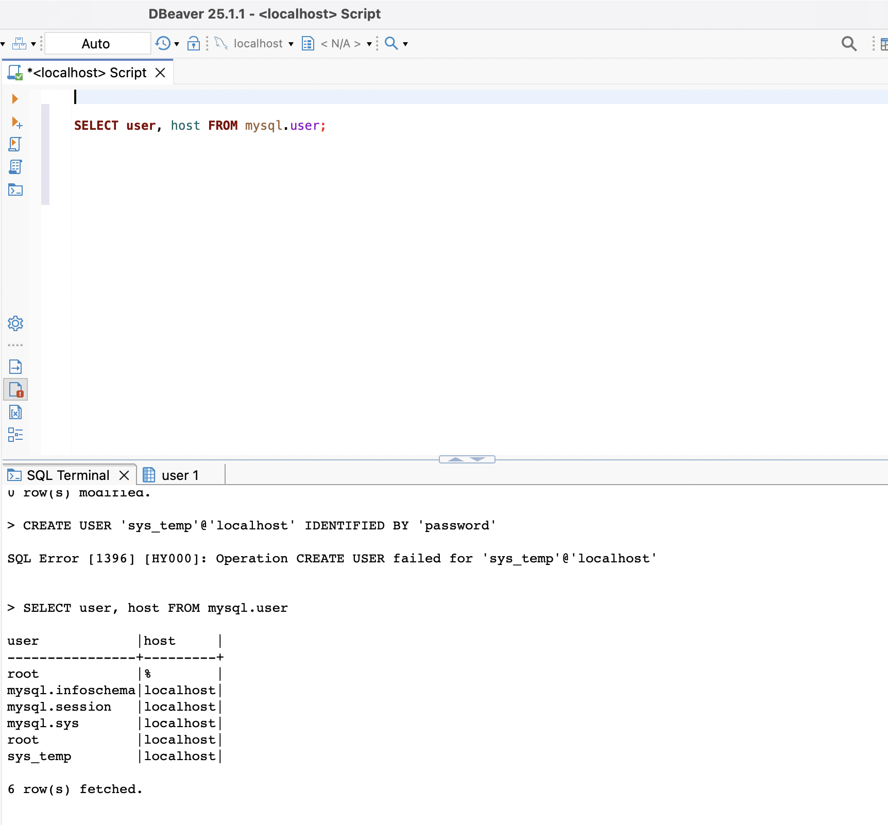
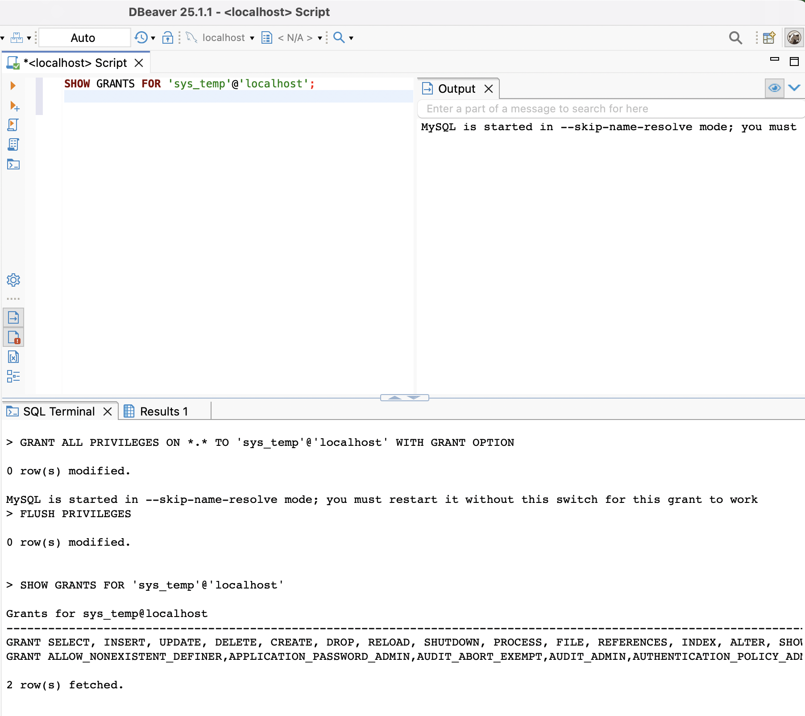
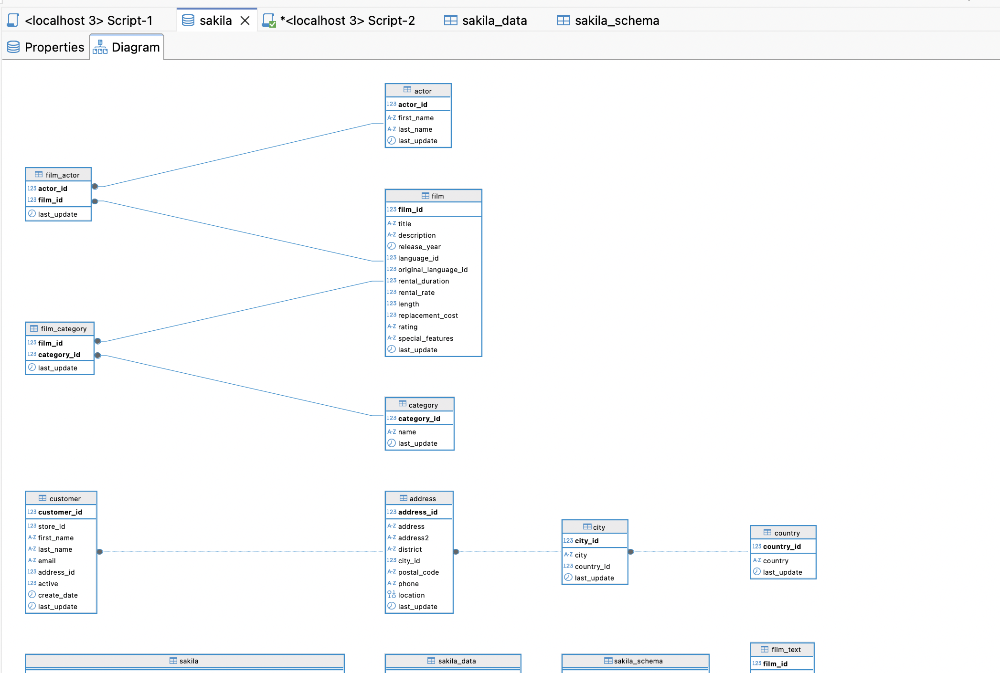
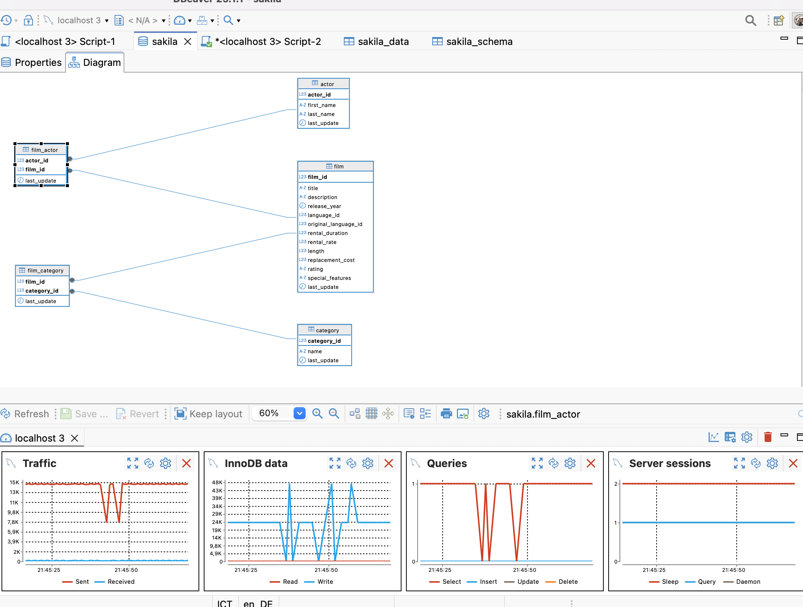
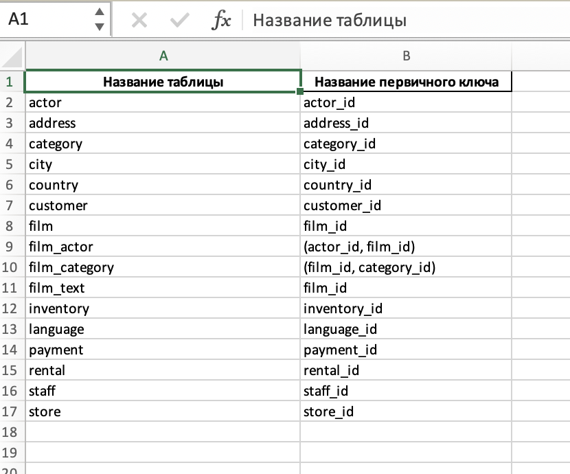

# Домашнее задание к занятию "`Работа с данными (DDL/DML)`" - `Решетов Павел`

---

### Задание 1

`Приведите ответ в свободной форме........`

1. `1.3. Выполните запрос на получение списка пользователей в базе данных. (скриншот)`

2. `1.5. Выполните запрос на получение списка прав для пользователя sys_temp. (скриншот)`

3. `1.8. При работе в IDE сформируйте ER-диаграмму получившейся базы данных. При работе в командной строке используйте команду для получения всех таблиц базы данных. (скриншот)`

---

### Задание 2

`Составьте таблицу, используя любой текстовый редактор или Excel, в которой должно быть два столбца: в первом должны быть названия таблиц восстановленной базы, во втором названия первичных ключей этих таблиц. Пример: (скриншот/текст)`

